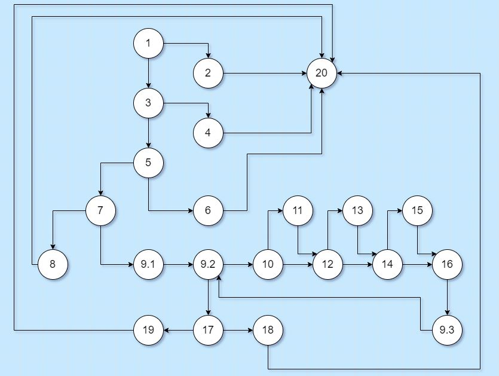
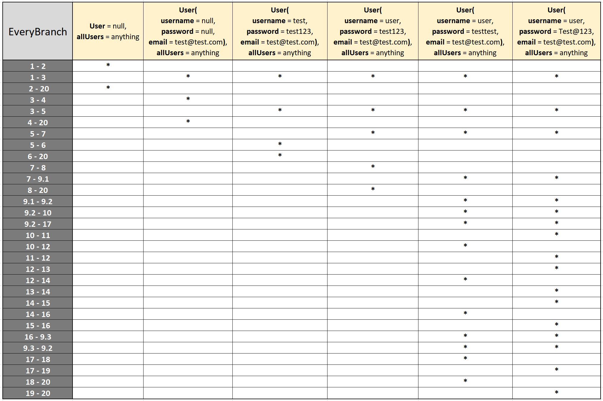

# Втора лабораториска вежба по Софтверско инженерство

## Аргетим Рамадани, бр. на индекс 161553

### Група на код: 

Ја добив групата на код 3

###  Control Flow Graph

### Цикломатска комплексност

Цикломатската комплексност на овој код е 8, истата ја добив преку формулата P+1, каде што P е бројот на предикатни јазли. Во случајoв P=7, па цикломатската комплексност изнесува 8.

### Тест случаи според критериумот  Every path 

....

### Тест случаи според критериумот Every branch

### Објаснување на напишаните unit tests
Прво имам направено test класа која се наоѓа во `src/test/java` со име **SILab2Test** на која што имам напишано функции посебно за секој од критериумите кои функции имаат нотација `@Test`

- Unit тестови за **Every branch** критериум  
Вкупно имам напишано 6 unit тест случаи, првите две *(линија код 5-6 и 8-9-10)* си фрлат исклучок и затоа користиме `assertThrows()`
и после со користење на `assertTrue()` само си проверуваме дали тој исклучок е тој што го очекуваме да се фрли на тој случаи, другите тестови се поедноставни
пошто само очекуваме `boolean` резултат `true` или `false` и тоа ни го овозможуваат `assertTrue()` и `assertFalse()` методите

 code snippet")
