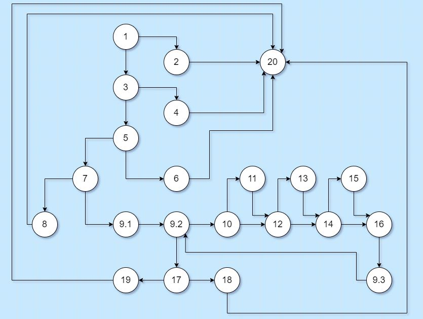
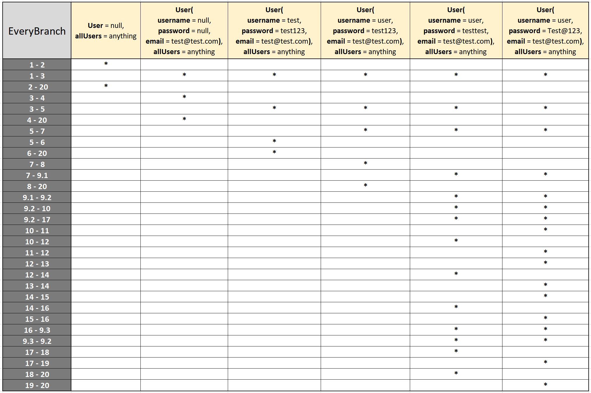

# Втора лабораториска вежба по Софтверско инженерство

## Аргетим Рамадани, бр. на индекс 161553

### Група на код: 

Ја добив групата на код 3

###  Control Flow Graph

### Цикломатска комплексност

Цикломатската комплексност на овој код е 8, истата ја добив преку формулата P+1, каде што P е бројот на предикатни јазли. Во случајoв P=7, па цикломатската комплексност изнесува 8.

### Тест случаи според критериумот  Every path 

....

### Тест случаи според критериумот Every branch

### Објаснување на напишаните unit tests

...
...